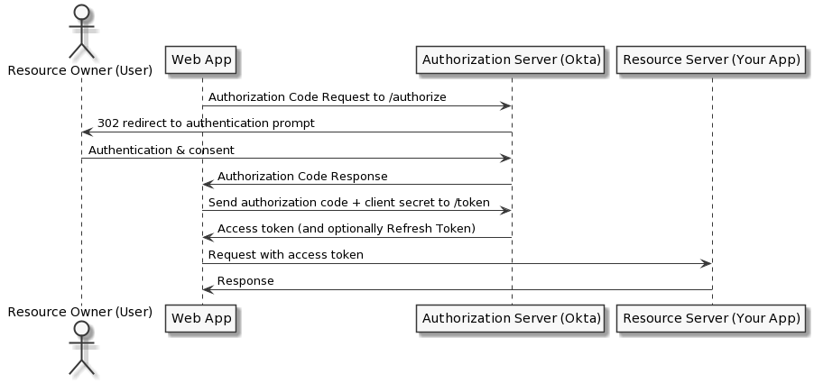
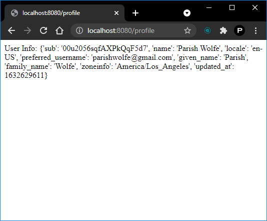

# okta_oauth2

simple oauth2 implementation with okta

## steps taken

- sign up for okta oauth2 provider
- create application in okta
- copy client_id and secret_id
- add user to application
- implement auth flow code

## auth code flow

1. user visits index and is routed to /auth
2. /auth collects application details, and redirects user to oauth provider
3. user logs in to oauth provider
4. user is redirected to callback
5. callback validates the user's code and state
6. application redirects to /profile
7. /profile sends request to okta../userinfo on behalf of the user
8. user's profile info is displayed.

